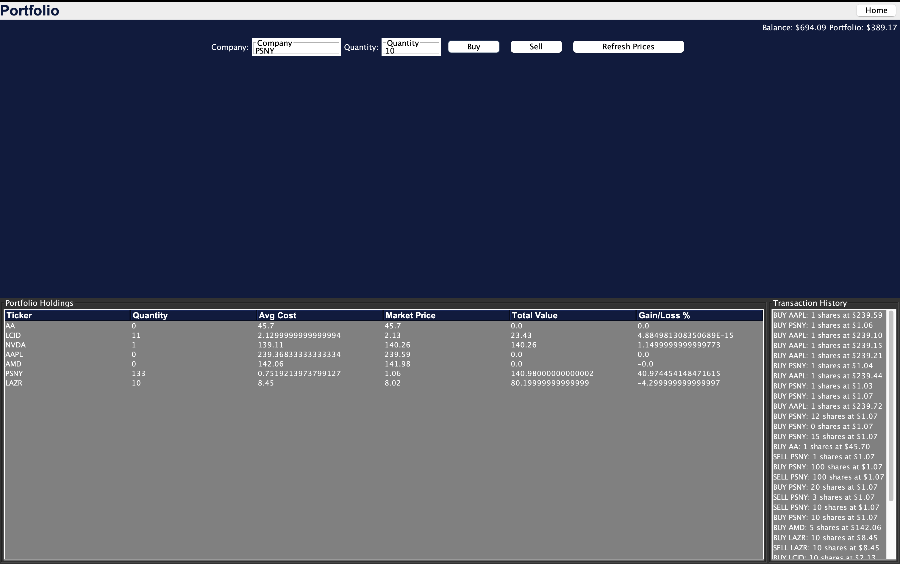

# StockFlow

**StockFlow** is a Stock Simulating Trader App designed to provide an interactive and engaging experience for users. It includes the following main features:
This project is a stock trading system built in Java, featuring Firebase for authentication and Alpha Vantage for real-time stock data. It follows clean architecture principles and uses Java Swing for an interactive GUI. The system enables users to analyze, trade, and manage stocks efficiently.

Check out the project on GitHub: [StockFlow](https://github.com/umairx25/StockFlow).

---

## Table of Contents

1. [Creators](#creators)
2. [Summary](#summary)
3. [Features](#features)
4. [Installation Instructions](#installation-instructions)
   - [Prerequisites](#prerequisites)
   - [Configuration Files](#configuration-files)
   - [Environment Variables](#environment-variables)
   - [Installation Steps](#installation-steps)
   - [Software and Package Management](#software-and-package-management)
   - [Common Issues & Solutions](#common-issues--solutions)
5. [Usage Guide](#usage-guide)
6. [Feedback](#feedback)
7. [Contributions](#contributions)

---
## Creators

The project was created by the following contributors:

- [YaseenSadat](https://github.com/YaseenSadat)
- [aneeqmuh](https://github.com/aneeqmuh)
- [umairx25](https://github.com/umairx25)
- [zarifali](https://github.com/zarifali)
- [SameerShahed71](https://github.com/SameerShahed71)

---

## Summary

🌟 **What StockFlow Does**  
StockFlow is a cutting-edge trading app designed to empower users with a seamless and risk-free stock trading experience. With features that let users explore diverse stocks, view historical data, and engage in simulated buying and selling, StockFlow brings the world of trading right to your fingertips. At its core is an AI-powered chatbot 🤖, your personal financial assistant, ready to answer your finance-related questions and guide you on your trading journey.

🌟 **Why We Built StockFlow**  
Born from the shared vision of five passionate University of Toronto students 🧑‍💻, StockFlow was crafted as a learning tool for beginner traders and finance enthusiasts alike. We set out to create an educational platform that combines innovation and accessibility, promoting financial literacy and trading skills in a zero-risk environment. By simulating real-world trading scenarios through paper trading, StockFlow bridges the gap between theory and practice, making finance fun and approachable 🌍.

🌟 **Why StockFlow is Unique**  
Unlike many trading apps that require real money and involve real-world risks, StockFlow provides a *no-risk* alternative without compromising on the excitement and realism of the trading experience. Whether you're testing strategies or honing your trading instincts, StockFlow lets you learn, grow, and trade without the fear of financial loss—your gateway to mastering the stock market without a single dollar spent! 💹✨

---

## Features

StockFlow is packed with cutting-edge features designed to deliver a seamless and educational stock trading experience. Here’s what makes StockFlow truly stand out:

### ✨ Account Management
Effortlessly create, manage, and secure your account:
- **Log In, Sign Up, and Log Out** functionalities ensure a smooth and secure user experience.
- Start your journey with ease and pick up right where you left off.

### 🏠 Home Page  
The central hub of StockFlow, where users can seamlessly navigate across the app:
- Intuitive layout to explore every feature with just a few clicks.
- Your gateway to managing stocks and learning finance like a pro.

### 🤖 AI Chatbot  
Meet your **personal finance mentor** powered by cutting-edge AI:
- A fully interactive chatbot that educates users on **finance-related topics**.
- From explaining technical indicators to answering your questions about stocks, this chatbot is your trusted guide to the stock market.

**📸 Sneak Peek**  


### 🔍 Explore Page  
Dive deep into the world of stocks with unparalleled data insights:
- Access over **50,000+ stocks** and several technical indicators.
- Easily **search stocks** by **ticker**, **exchange**, or **keyword** for quick and precise results.
- **Historical and Current Data**: Stay updated with the latest and past trends of your favorite stocks.
- Compare key indicators like **EMA**, **SMA**, and **RSI**, with real-time updates.
- Generate **customized charts** for every stock to visualize performance.
- Get a comprehensive **company summary** with vital details, helping you make informed decisions.

**📸 Explore Page in Action**  


### 📈 Portfolio  
Your personalized portfolio management system:
- **Buy/Sell Stocks**: Seamlessly trade stocks with just a few clicks.
- **Transaction History**: Keep track of all your past trades for full transparency.
- **Personalized Dashboard**: View your **current holdings**, track performance, and manage your investments with ease.
- Tailored insights to help you grow your portfolio and make smarter decisions.

**📸 Snapshot of Portfolio** 


---

## Installation Instructions 

Follow these detailed steps to set up and run the **StockFlow** application. Ensure you meet the necessary requirements and configure all dependencies properly.

### Prerequisites

1. **Java Development Kit (JDK)**:  
   - Install **OpenJDK 22 or higher**.
   - Ensure your IDE is configured with the correct SDK version.

2. **Maven**:  
   - The project uses Maven to manage dependencies. Ensure Maven is installed.

3. **Git**:  
   - Make sure Git is installed for cloning the repository.

---

### Configuration Files

#### 1. **Firebase Configuration**
   - Create a new Firebase project by visiting [Firebase Console](https://console.firebase.google.com).
   - Navigate to **Project Settings** -> **General**:
     - Copy the **Web API Key** and store it in the `.env` file under `WEB_API_KEY` (explained below).
   - Go to **Service Accounts** -> **Generate New Private Key**:
     - Download the JSON file and rename it as `config.json`.
     - Place this file in the project directory.

#### 2. **Polygon API Key**
   - Visit [Polygon.io](https://polygon.io/) and sign up for an account.
   - Generate a new API Key from your dashboard.
   - Save this key in the `.env` file under `POLYGON_API_KEY`.

#### 3. **GPT-Powered API Key (Version GPT-4o Mini)**
   - Sign up for OpenAI's API at [OpenAI Platform](https://platform.openai.com/).
   - Generate an API Key for GPT-4.
   - Save this key in the `.env` file under `GPT_API_KEY`.

---

### Environment Variables

Create a `.env` file in the project directory and include the following keys:

```plaintext
PROJECT_ID=your_project_id
WEB_API_KEY=your_web_api_key
FIREBASE_INFO=src/main/java/frameworks_driver/firebase_info.json
FIREBASE_AUTH_URL=https://identitytoolkit.googleapis.com/v1/accounts:signInWithPassword
POLYGON_API_KEY=your_polygon_api_key
GPT_API_KEY=your_gpt_api_key
GPT_BASE_URL=https://api.openai.com/v1/chat/completions
```
## Installation Steps

1. **Fork and Clone the Repository**:
   - Fork the repository from GitHub: [StockFlow Repository](https://github.com/umairx25/StockFlow).
   - Clone it locally:
     
bash
     git clone https://github.com/your-username/StockFlow.git
     cd StockFlow


2. **Set Up Dependencies**:
   - Ensure Maven is installed and run:
     
bash
     mvn clean install


3. **Run the Application**:
   - Open the project in your preferred IDE (e.g., IntelliJ IDEA or Eclipse).
   - Navigate to the Main class located in the app subfolder of src.
   - Click **Run** to start the application.

---

### Software and Package Management

- **Dependencies**: All required libraries and their versions are listed in the pom.xml. Key dependencies include:
  - **Firebase Admin SDK**: 9.4.1
  - **OpenAI GPT Integration**: 3.0.2
  - **JSON Processing**: 20240303
  - **JFreeChart**: 1.5.3
  - **JUnit (for testing)**: 4.13.1 and 5.8.1

---

### Common Issues & Solutions

1. **Missing Firebase Configuration**:
   - Ensure config.json is correctly placed under the specified directory. Check the path in the .env file matches.

2. **Maven Dependency Errors**:
   - Run the following command to clean and rebuild:
     
bash
     mvn clean install


3. **Java Version Compatibility**:
   - Ensure your JDK version matches or exceeds OpenJDK 22. You can check this by running:
     
bash
     java -version


4. **Environment Variables Not Loaded**:
   - Confirm the .env file exists in the project root and is correctly formatted.

## Usage Guide

Once you have successfully installed the application, follow these steps to start using **StockFlow**:

1. Open your preferred IDE (e.g., IntelliJ IDEA or Eclipse).
2. Navigate to the following path in the project directory: `src/main/java/app/Main.java`.
3. Run the `Main.java` file to launch the application.

---

### 📸 Example Walkthrough

To help you get started, here are some visuals:

   [](assets/Logging_In_View.mov)


Feel free to explore the app’s features such as the **Explore Page**, **Portfolio Page**, and the **AI Chatbot** for an interactive and educational trading experience. 🚀

## Feedback

We value your input and encourage you to share your thoughts on **StockFlow**. Feedback helps us improve and create a better experience for all users. Here's how you can provide feedback:

1. **How to Submit Feedback**  
   - Fill out our [Google Form](https://forms.gle/a9m8UvACvpv2ZzBn6). It's quick and easy to use.

2. **What Counts as Valid Feedback**  
   - Suggestions for new features or enhancements.
   - Reports on bugs or issues you encounter.
   - Comments on usability or user experience.

3. **What to Expect When Submitting Feedback**  
   - Your feedback will be reviewed by the development team.
   - We will prioritize critical bugs and evaluate suggestions for future updates.
   - While we cannot guarantee every suggestion will be implemented, we value and appreciate your effort in helping us improve.

Thank you for taking the time to share your feedback and help make **StockFlow** better!

## Contributions

We welcome contributions to **StockFlow**! Whether you're fixing bugs, adding features, or improving documentation, your help is greatly appreciated. Follow the steps below to get started:

### How to Contribute

1. **Fork the Repository**  
   - Navigate to the [StockFlow Repository](https://github.com/umairx25/StockFlow) on GitHub.  
   - Click the **Fork** button in the top-right corner to create your own copy of the repository.

2. **Clone Your Fork**  
   - Clone your forked repository to your local machine:
     ```bash
     git clone https://github.com/your-username/StockFlow.git
     cd StockFlow
     ```

3. **Create a New Branch**  
   - Use a descriptive name for your branch based on the feature or fix:
     ```bash
     git checkout -b feature/new-feature
     ```

4. **Make Your Changes**  
   - Implement your changes and commit them with clear and concise messages:
     ```bash
     git add .
     git commit -m "Add detailed description of your changes"
     ```

5. **Push Your Changes**  
   - Push your branch to your forked repository:
     ```bash
     git push origin feature/new-feature
     ```

6. **Submit a Pull Request (PR)**  
   - Go to your forked repository on GitHub and click **Compare & pull request**.  
   - Provide a detailed description of your changes, including what issue it resolves or what feature it adds.

---

### Guidelines for a Good Merge Request

- Ensure your code follows the project's coding standards.
- Write clear and descriptive commit messages.
- Include comments and documentation where necessary.
- If applicable, include tests to validate your changes.

---

### Contribution Review Process

1. All pull requests will be reviewed by the project maintainers.
2. You may be asked to make revisions based on feedback.
3. Once approved, your contribution will be merged into the main repository.

Thank you for your interest in contributing to **StockFlow**! Together, we can make this project even better.

